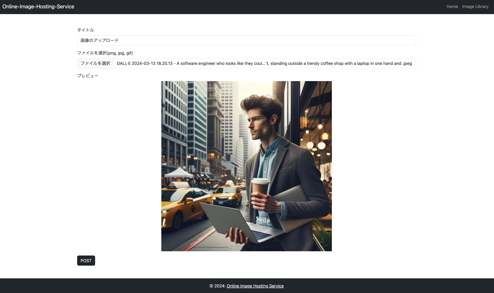
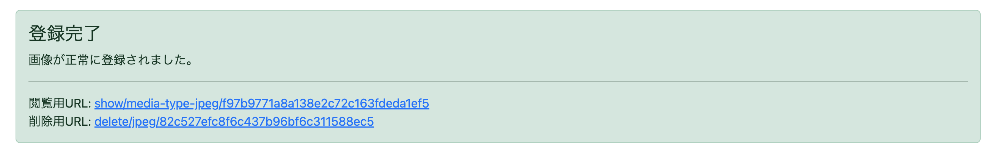
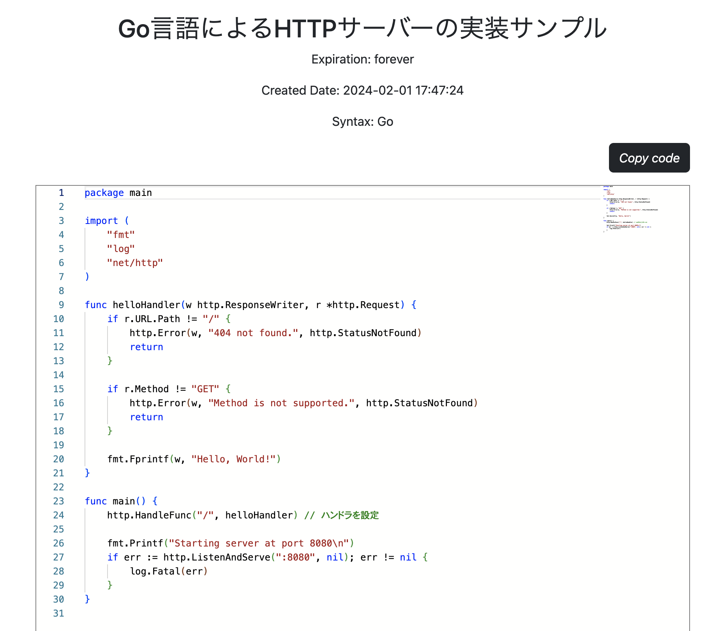

# Online-Image-Hosting-Service

# 概要

Online-Image-Hosting-Serviceは登録不要で誰でも簡単に利用できる画像共有アプリです。</br>
あなたの思い出の写真やお気に入りの瞬間を共有して、世界中の人々とつながりましょう。写真を投稿することで、大切な瞬間を保存し、他のユーザーと共有することができます。

以下プロジェクト URL</br>
https://online-image-hosting-service.seiprojects.com/top

# DEMO
https://github.com/seiichikick0404/Online-Image-Hosting-Service/assets/69625901/2bd4fa39-febf-472e-80cc-cb677fb030f3

# 開発環境の構築

今回は開発環境のみ Docker を使って開発をしてるので誰でもすぐにローカルマシンで動作確認が可能です</br>

## リポジトリをクローン

```bash
git clone https://github.com/seiichikick0404/Online-Image-Hosting-Service.git
```

## 環境変数の配置

以下を.env ファイルに記述し、プロジェクト直下と src ディレクトリ直下に配置してください。

```bash
DATABASE_NAME=online_image_hosting_service
DATABASE_USER=任意のユーザー名
DATABASE_PASSWORD=任意のパスワード
DATABASE_ROOT_PASSWORD=任意のパスワード
DATABASE_HOST=mysql
```

## Docker イメージをビルド・コンテナ起動

クローンしたプロジェクトのルートディレクトリで以下を実行</br>
Docker をインストールしてない場合は公式からインストールしてから以下コマンドを実行してください。

```bash
# ビルド実行
docker compose build

# コンテナ立ち上げ
docker compose up -d
```

## マイグレーション実行

必要なテーブルを即座に構築します。

```bash
php console migrate --init
```

## シーダー実行

必要なレコードを即座に登録します。

```bash
php console seed
```


## 基本的なコマンド一覧

| コマンド                                         | 内容                                                                                                              |
| ------------------------------------------------ | ----------------------------------------------------------------------------------------------------------------- |
| php console code-gen migration --name {FILENAME} | マイグレーションファイル生成                                                                                      |
| php console code-gen seed --name {FILENAME}      | シーダーファイルの生成                                                                                            |
| php console migrate                              | マイグレーションの実行</br> --init オプションを付けると migrations テーブルも同時に生成します                     |
| php console migrate --rollback                   | migrations テーブルを参照して DB を一つ前の状態に戻す</br>rollback 2 とすれば指定回数分ロールバックを実行します。 |

ここまで正常に動作したら以下の URL から動作を確認してください。</br>
http://localhost:8080/

# 使い方

## 画像のアップロード



ヘッダーから Home を選択し、各入力欄を埋めて下さい。</br>
| 入力項目 | 内容 |
| ---- | ---- |
| タイトル | 画像のタイトルを入力 |
| ファイルを選択 | 投稿したい画像をファイルを選択(png, jpeg, gif に対応) |



登録が完了すると画面下部に「登録完了」通知が表示されます。</br>
ここで入力内容に問題がある場合、問題のあるフォーム上部にエラー内容が表示されます。
詳しいバリデーションルールは、[工夫した点や苦労した点](#工夫した点や苦労した点)の安全なバリデーション処理セクションを参照ください。

| URL 種別   | 内容                             |
| ---------- | -------------------------------- |
| 閲覧用 URL | 画像の詳細ページへのリンクです。 |
| 削除用 URL | 画像を削除する際のリンクです。   |

## 詳細ページ



アップロード時に生成された閲覧用 URL から閲覧ページへ遷移します。</br>
ここでは以下の情報が表示されます。

1. 画像タイトル
2. アップロードファイル
3. 閲覧数
4. アップロード日

## 画像一覧ページ


このページでは他のユーザーが投稿した画像が閲覧可能です。</br>
画像をクリックすることで詳細ページへ遷移することもできます。あなたのお気に入り画像を投稿しよう！

# 主な使用技術

<p style="display: inline">
  <!-- PHP -->
  
  <!-- MySQL -->
  
  <!-- HTML5 -->
  
  <!-- CSS3 -->
  
    <!-- JavaScript -->
  
  <!-- Amazon AWS -->
  
  <!-- Amazon EC2 -->
  
  <!-- Nginx -->
  
  <!-- Ubuntu -->
  
  <!-- Docker -->
  
  <!-- Bootstrap -->
  
</p>

## その他ツールライブラリ

| 名称    | 用途                  |
| ------- | --------------------- |
| Draw.io | ER 図やクラス図の作成 |
| Certbot | SSL 証明書発行など    |
| GitHub  | ソースコードの管理    |

# 開発の経緯

- 3 層アーキテクチャの開発
- Amazon EC2 を使ったデプロイ
- スケーラビリティを意識したソフトウェアアーキテクチャ
- 非同期通信についての理解
- MVC アーキテクチャの習熟
- シーダーやマイグレーションシステムの理解

# 工夫した点や苦労した点

主に以下の点を意識しました

- スケーラビリティを考慮したファイル管理
- アップロード制限の設定
- 安全なバリデーション処理
- cron ジョブによる画像の自動削除
- 適切なインスタンスタイプの選定

その他の点は以前のプロジェクトと重複するので省略します。</br>
[以前作成したスニペット共有アプリはこちら](https://github.com/seiichikick0404/Text-Snippet-Sharing-Service)

## スケーラビリティを考慮したファイル管理

アップロードされた画像をサーバーに直接保存する方法を採用しています。</br>
Amazon S3 などのクラウドストレージサービスも検討しましたが、予想される画像の保存量が比較的少ないため、このアプローチを選択。</br>
ファイル名は、UUID を MD5 でハッシュ化した値を使用しています。このハッシュ値の最初の 2 文字を、ファイルを保存するディレクトリ名として採用しています。</br>
例えば、「afgeg12ge2.png」というファイル名が生成された場合、このファイルは「af」という名前のディレクトリに保存されます。</br>
この方法により、一つのディレクトリ内に大量のファイルが集中することを防ぎ、ファイルシステムのパフォーマンスを維持しながら、画像ファイルの管理をより効率的に行うことができます。</br>
将来的にファイル数が増加した場合でも、ディレクトリレベルでの均等なファイル分散ができ、スケーラビリティとパフォーマンスのバランスを保ちます。

```
ディレクトリ構成のイメージ

- storage
  - fa
    - sample1.png
  - 13
    - sample2.jpeg
  - 1h
    - sample3.gif

```

## アップロード制限の設定

過度なアップロードでサーバー負荷を上げないように 1 日のアップロード制限を 5 枚に設定しました。</br>
登録不要で使えるサービスにしたかったため、アップロード時に ip も保存することである期間のアップロード数をトラッキングできるようにしました。/br>
これにより、制限枚数を超えて保存しようとするとエラーが出力されるようになってます。</br>

## 安全なバリデーション処理

今回設定してる主要なバリデーション処理です。

| バリーデーション           | 説明                                          |
| -------------------------- | --------------------------------------------- |
| null チェック              | タイトル、画像が入力されているか              |
| 文字数制限チェック         | 文字数が 255 文字以下であるか                 |
| 拡張子チェック             | 拡張子が png, jpeg, gif のいずれかであるか    |
| IP フォーマットチェック    | IP アドレスのフォーマットが不正な形式でないか |
| 1 日のアップロード容量制限 | 1 日のアップロード容量が 3MB 以下であるか     |
| 1 日のアップロード枚数制限 | 1 日のアップロード枚数が 5 枚以下であるか     |

## cron ジョブによる画像の自動削除

本アプリケーションでは、1 ヶ月間閲覧されていない画像を自動的に削除する機能を導入しています。</br>
この自動削除機能は、check_daily_access.php スクリプトを用いて実現されており、cron ジョブによって毎日午前 0 時にこのスクリプトが実行されます。

自動削除処理の実行方法
自動削除処理は以下のコマンドを用いて実施されます：

```bash
php console cron
```

このコマンドで自動削除処理が行われ、その結果を cron_execution_log に保存し、バッチ処理が適切に行われているかチェックできるようにしました。</br>

以下実際のログファイル

```
Executed at: 2024-03-12 21:17:01
Command: php console cron
Output: string(7) "migrate"
string(8) "code-gen"
string(13) "state-migrate"
string(4) "seed"
string(4) "cron"
[]
Checking data for deletion...
No images were deleted.
```

この仕組みにより、ストレージの無駄遣いを防ぎ、サーバーのパフォーマンスを最適化します。さらに、自動化により日々のメンテナンス負担を軽減し、サービスの運営効率を向上させます。

## 適切なインスタンスタイプの選定

プロジェクト初期には、AWS の t2.micro インスタンスを使用していました。しかし、VS Code から SSH 接続を頻繁に行い、ソースコードの量が増えるにつれて git での監視対象ファイルが増加すると、メモリ消費が急増する問題に直面しました。</br>これにより、不具合の検証作業に支障をきたすことが明らかになりました。

**アップグレードの検討**</br>
この問題に対処するため、より高性能な t3.small インスタンスへのアップグレードを決定しました。t3.small は、t2.micro に比べて CPU およびメモリリソースが充実しており、VS Code からの SSH 接続時にも個人開発レベルでは問題ないパフォーマンスでした。

**インスタンス選定の重要性**</br>
この経験から、CPU やメモリの使用率を常に監視し、プロジェクトのニーズに合わせて適切なインスタンスタイプを選定することの重要性を再認識しました。主に以下の 2 点で検証しました。</br>

- サーバー内で`top, htop`コマンドで現在の CPU・メモリ使用率の確認
- AWS コンソールで高負荷がかかった時間などの特定

# 参考文献

https://qiita.com/Kernel_OGSun/items/55afb7e93b445f1be019

https://blog.flatt.tech/entry/file_upload_security#%E5%AF%BE%E7%AD%962-%E3%83%95%E3%82%A1%E3%82%A4%E3%83%AB%E5%90%8D%E3%81%AE%E3%83%81%E3%82%A7%E3%83%83%E3%82%AF
